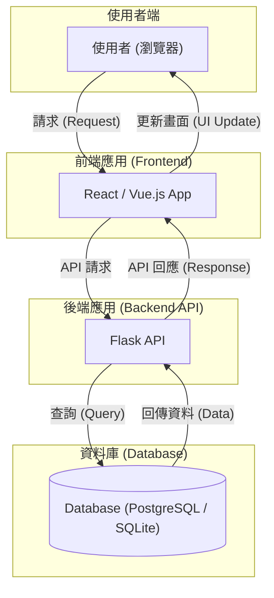

# 高階設計文檔 (High-Level Design)

-   **文件版本**: v1.0.0
-   **作者**: Gemini (軟體架構師)

---

## 1. 架構總覽 (Architecture Overview)

本專案將採用「**前後端分離 (Headless)**」的現代 Web 架構。後端將作為一個純粹的 **RESTful API** 服務，而前端將是一個獨立的單頁應用 (Single-Page Application, SPA)。

-   **設計原則與優點**:
    1.  **獨立開發與部署 (Independent Development & Deployment)**: 前、後端團隊可以使用各自獨立的技術棧與開發流程並行工作，互不阻塞。前端可以部署在 Vercel/Netlify 等靜態託管平台，後端 API 可獨立部署在 Heroku/Fly.io 等應用服務平台，發布週期更靈活。
    2.  **技術棧靈活性 (Technology Stack Flexibility)**: 此架構不將前端與後端技術綁定。未來若需開發原生 App (iOS/Android) 或其他客戶端，它們都可以重複使用同一套後端 API，最大化程式碼複用性並降低長期維護成本。
    3.  **清晰的關注點分離與擴展性 (SoC & Scalability)**: 前端專注於 UI/UX，後端專注於業務邏輯與數據處理。這種清晰的邊界使得系統更容易理解與維護。同時，後端 API 服務可以根據負載獨立進行擴展，而無需改動前端。

-   **溝通方式**:
    -   前後端將嚴格透過 **RESTful API** 進行非同步通訊。
    -   所有數據交換格式統一為 **JSON**。

---

## 2. 技術選型與理由 (Technology Stack & Justification)

為滿足 MVP 的快速開發需求，並兼顧未來的擴展性，後端技術選型如下：

| 技術領域 | 選擇 | 選擇理由 (WHY) |
| :--- | :--- | :--- |
| **Web 框架** | **Flask** | 作為一個輕量級的「微框架」，Flask 啟動成本低，學習曲線平緩，非常適合 MVP 階段。其豐富的擴展生態（如 Blueprints）能確保專案在功能變複雜時，仍可維持良好的結構與擴展性。 |
| **資料庫** | **PostgreSQL** | 一款功能強大、穩定可靠的開源關聯式資料庫。它能處理複雜的數據關係查詢，具備優異的擴展性，足以應對未來使用者增長與功能擴展的需求。開發階段可搭配 **SQLite** 以簡化本機環境設定。 |
| **ORM** | **SQLAlchemy** | Python 世界中功能最完整、社群最活躍的 ORM。它能將複雜的資料庫操作抽象化為 Python 物件，有效降低 SQL 注入風險，並使資料庫邏輯更易於測試與維護。搭配 `Flask-SQLAlchemy` 擴展可無縫整合。 |
| **資料驗證** | **Marshmallow** | 用於複雜數據的序列化/反序列化及驗證。在 API 開發中，它能確保傳入的 JSON 數據符合預期格式，並能優雅地將 SQLAlchemy 模型物件轉換為 JSON，是構建健壯 API 的關鍵工具。 |

---

## 3. 後端專案結構 (Backend Project Structure)

我們將採用 **Flask Blueprints** 來組織專案。其核心目的是實現「**關注點分離 (Separation of Concerns)**」，將應用程式按功能模組（如 `auth`, `habits`, `moods`）進行劃分。每個 Blueprint 都是一個迷你的 Flask 應用，擁有自己的路由、模型和業務邏輯，使得整個專案結構清晰、易於維護，並方便團隊成員分工協作。

推薦的專案結構如下：

```
/mindtrack-api
|-- app/                           # 核心應用程式目錄
|   |-- __init__.py                # 應用程式工廠 (App Factory)
|   |-- blueprints/                # 存放所有功能藍圖
|   |   |-- auth/                  # 處理使用者認證 (註冊、登入)
|   |   |   |-- __init__.py
|   |   |   `-- routes.py
|   |   |-- habits/                # 處理習慣與心情的增刪改查
|   |   |   |-- __init__.py
|   |   |   `-- routes.py
|   |   `-- insights/              # 處理數據洞察相關邏輯
|   |       |-- __init__.py
|   |       `-- routes.py
|   |-- models.py                  # SQLAlchemy 資料庫模型
|   |-- schemas.py                 # Marshmallow 資料驗證結構
|   `-- extensions.py              # 集中管理 Flask 擴充套件實例
|-- migrations/                    # 資料庫遷移腳本 (Alembic)
|-- tests/                         # 單元測試與整合測試
|-- config.py                      # 環境設定檔 (開發、生產)
|-- run.py                         # 應用程式啟動入口
`-- .flaskenv                      # Flask 環境變數
```

---

## 4. 高階架構圖 (High-Level Architecture Diagram)

此圖展示了系統各主要元件之間的互動流程。


