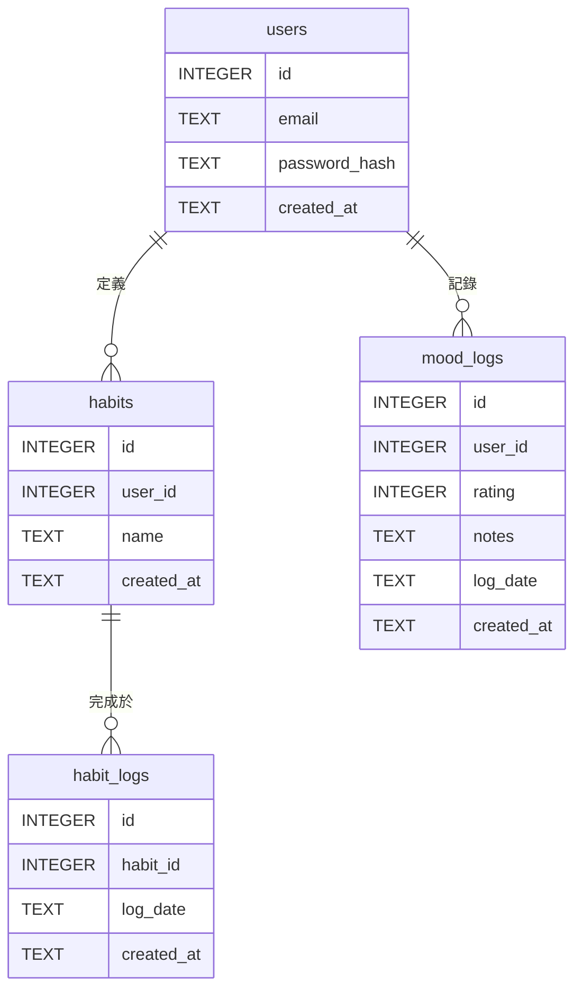

# 資料庫綱要定義文檔

-   **文件版本**: v1.0.0
-   **作者**: Gemini (資料庫管理員)

---

## 1. 設計原則與選型 (Design Principles & Engine)

-   **正規化 (Normalization)**:
    本次資料庫設計嚴格遵循**第三正規化 (3NF)**。這意味著每個資料表中的所有欄位都只依賴於該表的主鍵，旨在徹底消除資料冗餘，確保數據的一致性與完整性，為未來的功能擴展打下堅實的基礎。

-   **資料庫引擎**:
    在 MVP 階段，我們確認使用 **SQLite**。理由如下：
    1.  **零配置與易於整合**: SQLite 是一個無伺服器的資料庫引擎，整個資料庫就是一個單一的檔案。這極大地簡化了開發環境的搭建與部署流程，讓開發者能專注於應用程式邏輯本身。
    2.  **輕量級與足夠的效能**: 對於專案初期使用者量不大、讀寫頻率適中的場景，SQLite 提供了卓越的效能，其輕量級的特性也使得它非常適合整合進 Python 應用程式中進行快速原型開發與測試。

---

## 2. 資料表定義 (Table Definitions)

### users
-   **用途說明**: 儲存使用者帳號的基本資訊與憑證。

| 欄位名稱 | 資料類型 (SQLite) | 約束/索引 | 欄位描述 |
| :--- | :--- | :--- | :--- |
| `id` | `INTEGER` | `PK`, `AUTOINCREMENT` | 使用者唯一識別碼 (主鍵) |
| `email` | `TEXT` | `UNIQUE`, `NOT NULL`, `INDEX` | 使用者登入信箱，具備唯一性 |
| `password_hash` | `TEXT` | `NOT NULL` | 使用者密碼的雜湊值 |
| `created_at` | `TEXT` | `NOT NULL` | 帳號建立時間戳記 (ISO8601 格式) |

### habits
-   **用途說明**: 儲存由使用者定義的、需要追蹤的習慣項目。

| 欄位名稱 | 資料類型 (SQLite) | 約束/索引 | 欄位描述 |
| :--- | :--- | :--- | :--- |
| `id` | `INTEGER` | `PK`, `AUTOINCREMENT` | 習慣唯一識別碼 (主鍵) |
| `user_id` | `INTEGER` | `FK(users.id)`, `NOT NULL`, `INDEX` | 關聯到 `users` 表，表示此習慣的擁有者 |
| `name` | `TEXT` | `NOT NULL` | 習慣的名稱 (例如：「晨間冥想」) |
| `created_at` | `TEXT` | `NOT NULL` | 習慣建立時間戳記 (ISO8601 格式) |

### habit_entries
-   **用途說明**: 記錄使用者完成某個習慣的具體日期，是「打卡」行為的日誌。

| 欄位名稱 | 資料類型 (SQLite) | 約束/索引 | 欄位描述 |
| :--- | :--- | :--- | :--- |
| `id` | `INTEGER` | `PK`, `AUTOINCREMENT` | 習慣完成紀錄的唯一識別碼 (主鍵) |
| `user_id` | `INTEGER` | `FK(users.id)`, `NOT NULL`, `INDEX` | 關聯到 `users` 表，為方便查詢而設 |
| `habit_id` | `INTEGER` | `FK(habits.id)`, `NOT NULL`, `INDEX` | 關聯到 `habits` 表，表示哪一個習慣被完成 |
| `entry_date` | `TEXT` | `NOT NULL` | 習慣完成的日期 (格式: `YYYY-MM-DD`) |
| - | - | `UNIQUE(user_id, habit_id, entry_date)` | 確保同一使用者同一天同個習慣只能打卡一次 |

### mood_logs
-   **用途說明**: 儲存使用者每日的心情評分與相關筆記。

| 欄位名稱 | 資料類型 (SQLite) | 約束/索引 | 欄位描述 |
| :--- | :--- | :--- | :--- |
| `id` | `INTEGER` | `PK`, `AUTOINCREMENT` | 心情紀錄的唯一識別碼 (主鍵) |
| `user_id` | `INTEGER` | `FK(users.id)`, `NOT NULL`, `INDEX` | 關聯到 `users` 表，表示此心情紀錄的擁有者 |
| `rating` | `INTEGER` | `NOT NULL` | 心情評分 (例如：1 到 5 的整數) |
| `notes` | `TEXT` | - | 關於該心情的選填文字筆記 |
| `log_date` | `TEXT` | `NOT NULL` | 心情紀錄的日期 (格式: `YYYY-MM-DD`) |
| - | - | `UNIQUE(user_id, log_date)` | 確保同一使用者一天只能記錄一次心情 |

---

## 3. 實體關係圖 (Entity-Relationship Diagram - ERD)



---

## 4. 關聯文字說明 (Relationship Description)

-   **`users` 與 `habits`**: 一對多 (`1-to-N`) 關係。一個使用者可以定義多個習慣，但每個習慣僅歸屬於一個使用者。
-   **`users` 與 `mood_logs`**: 一對多 (`1-to-N`) 關係。一個使用者可以擁有多筆心情紀錄（不同日期），但每筆紀錄僅歸屬於一個使用者。
-   **`habits` 與 `habit_entries`**: 一對多 (`1-to-N`) 關係。一個習慣的定義，可以對應多筆完成紀錄（打卡日誌）。
-   **`users` 與 `habit_entries`**: 一對多 (`1-to-N`) 關係。一個使用者可以完成多筆習慣打卡紀錄。此處在 `habit_entries` 中也加入 `user_id` 是一種輕微的「反正規化」設計，目的是為了在查詢某位使用者的所有打卡紀錄時，可以避免一次額外的 `JOIN` 操作，從而提升效能。

---

## 5. 資料庫填充腳本 (Database Seeding Script)

以下 SQL 腳本可用於在資料庫建立後，填充一些初始的範例數據以供開發與測試。

```sql
-- 清除舊資料以確保腳本可重複執行
DELETE FROM users;
DELETE FROM habits;
DELETE FROM habit_entries;
DELETE FROM mood_logs;

-- 插入兩位使用者
INSERT INTO users (email, password_hash, created_at) VALUES
('alice@example.com', 'pbkdf2:sha256:...', strftime('%Y-%m-%d %H:%M:%S','now')),
('bob@example.com', 'pbkdf2:sha256:...', strftime('%Y-%m-%d %H:%M:%S','now'));

-- 假設 Alice 的 user_id=1, Bob 的 user_id=2
-- 為他們分別建立習慣
INSERT INTO habits (user_id, name, created_at) VALUES
(1, '晨間冥想 10 分鐘', strftime('%Y-%m-%d %H:%M:%S','now')),
(1, '閱讀一章節的書', strftime('%Y-%m-%d %H:%M:%S','now')),
(2, '晚上跑步 3 公里', strftime('%Y-%m-%d %H:%M:%S','now'));

-- 假設上述習慣的 habit_id 分別為 1, 2, 3
-- 記錄一些習慣完成的狀況
INSERT INTO habit_entries (user_id, habit_id, entry_date) VALUES
(1, 1, strftime('%Y-%m-%d','now', '-2 days')), -- Alice 在前天完成了冥想
(1, 2, strftime('%Y-%m-%d','now', '-1 day')),  -- Alice 在昨天完成了閱讀
(1, 1, strftime('%Y-%m-%d','now')),           -- Alice 在今天完成了冥想
(2, 3, strftime('%Y-%m-%d','now'));           -- Bob 在今天完成了跑步

-- 記錄一些心情
INSERT INTO mood_logs (user_id, rating, notes, log_date) VALUES
(1, 3, '有點焦慮。', strftime('%Y-%m-%d','now', '-2 days')),
(1, 4, '讀完書感覺很好。', strftime('%Y-%m-%d','now', '-1 day')),
(1, 5, '冥想後精神飽滿！', strftime('%Y-%m-%d','now')),
(2, 5, '跑完步，通體舒暢！', strftime('%Y-%m-%d','now'));
```
